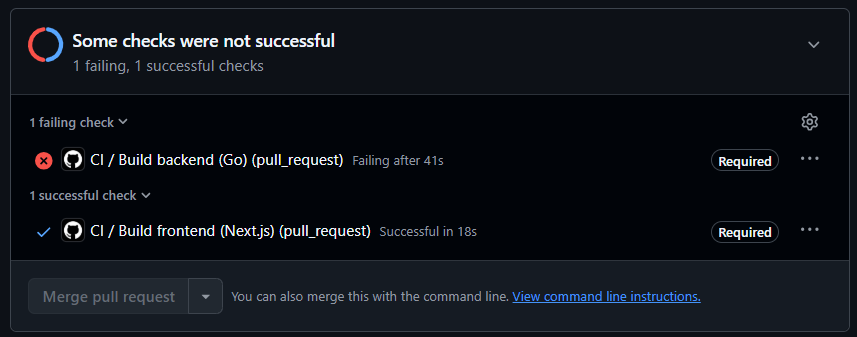

# Decisiones — TP1

## 1. Por qué Git no pudo resolver el conflicto solo — y qué habría tenido que pasar para que nunca apareciera.
Git no puede resolver el conflicto por su propia cuenta ya que no sabe cual es la intencion de la persona que pusheo.
Para que el problema nunca hubiera aparecido lo que se puede hacer es traer los cambios del main antes de hacer la pull request. Resolves conflictos antes de pushear.

## 2. Qué problemas encontraste y cómo los solucionaste.
El unico problema que tuve y se pueden ver en los commits es que me olvide de activar el ruleset entonces el primer commit si paso directo a produccion.
despues active el ruleset y ya funciono.

## 3. Declaración de uso de IA: qué partes hiciste con ayuda de inteligencia artificial y cómo verificaste lo que te devolvió.
Hasta ahora no utlice la IA para mucho mas que buscar comandos.

# Decisiones — TP2

## 1. Porque elegi esta app?
Docuwave es una app que estoy construyendo activamente y que conozco muy bien. Ademas cumple con los requerimientos de estructura del proyecto (Front + back + db).
Aparte de todo esto es una app en la cual ya tengo CI y test implementados. Trabajo con Github Flow.

## Decisiones de contenerización:
Las imagenes base elegidas son:
- Backend (go), en etapa de build golang:1.24-alpine ya que esta incluye todas las herramientas necesarias para que el proyecto compile. Es muy importante utilizar esta version ya que la 1.23 no compila por falta de funcionalidades.
Luego en la etapa de build se utiliza la alpine:3.20. Go compila a binario estatico por la imagen de ejecucion no necesita runtime alguno. Solo se necesita el binario y el cerificado TLS para las llamadas como las de OAuth.
- Frontend (Next.js), todas las etpas del multistage utilizan el node:20-alpine esto es para evitar incompatibilidades de binarios nativos entre etapas.

Etapas: 
- Backend: Utiliza 2 etapas:
builder en donde se copia go.mod y go.sum y despues se corre go mod download esto es para cachear las dependencias y no descargalas en cada build. Luego copia el codigo y lo compila.
Despues esta la etapa final la cual copia unicamente el binario compilado.
- Frontend: utiliza 3 capas:
La primera capa "deps" instala las dependencias con npm ci utilizando el package.json, esto lo hace esta capa para una vez para cachear las dependencias y no tener que instalarlas en cada build.
La etapa de "builder" utiliza las deps cacheadas y copia el codigo fuente y corre npm run build. 
Luego la etapa de "runner" copia lo minimo para poder ejecutar (.next/standalone, .next/static y la carpeta public). Esta etapa no copia el codigo fuente ni "node_modules".

Que persiste y que no?:
Lo unico que persiste es el volumen de la base de datos de postgres. Este solo se borra si se hace de manera manual o si se agrega la flag -v en el docker compose down

- Se utiliza el dns interno de docker compose.

## 2. Qué problemas encontraste y cómo los solucionaste.
No me encontre con muchos problemas ya que yo ya contaba con los Dockerfiles del proyecto, si tuve problemas con las creedenciales de github ya que no me dejaba iniciar sesion para subir las imagenes compiladas.

## 3. Declaración de uso de IA: qué partes hiciste con ayuda de inteligencia artificial y cómo verificaste lo que te devolvió.
Para este tp utilize a la IA como guia paso a paso para crear la imagenes y subirlas como package de github. Pude verifcar que lo que me daba estaba bien a traves de las consignas del tp ya que fui comparando paso a paso que todo estaba correcto.

# Decisiones — TP3

## 1. Decision tiempo de la sprint:
Se decidio que la sprint va a durar 1 semana ya que esto es el tiempo en el cual se desarollan las actividades de la materia, un tp por semana. Por lo que el tiempo limite para desarollar el tp4 (teoricamente) es hasta el jueves 3 de septiembre.

## Decision de la cantidad de tareas que se pueden hacer al mismo tiempo:
Se decidio solo tener 2 tareas como maximo al mismo tiempo para que no se acumule trabajo sin terminar que el que peudo gestionar. Este numero viene de utlizar la regla de participantes + 1, este 1 nos permite tener flexibilidad opertiva ya que si ocurre un bloqueo o queremos preparan una tarea antes de terminal la que esta en progreso esto nos permite hacerlo.

## Decision de las tareas para la HU-1:
Yo ya tengo una implementacion de un workflow de CI en el repo orginal del proyecto [docuwave](https://github.com/max20050/DocuWave) por lo que la primer tarea para mi sera migrar ese archivo .yml al repo actual.
Despues puse como segunda tarea agregar el badge del CI al readme.md

## 2. Qué problemas encontraste y cómo los solucionaste.
En este tp no hubo problemas ya que segui la guia paso a paso e implemnte todo lo que pedia. 

## 3. Declaración de uso de IA: qué partes hiciste con ayuda de inteligencia artificial y cómo verificaste lo que te devolvió.
Para este tp no utilice la IA.

# Decisiones — TP4

## 1. Estructura elegida del pipeline
 
El workflow (`.github/workflows/ci.yml`) corre en cada Pull Request contra main y en
cada push a main. Se definieron dos jobs independientes:
 
- `build-backend`: construye la imagen del backend (Go) usando el Dockerfile de `backend/`.
- `build-frontend`: construye la imagen del frontend (Next.js) usando el Dockerfile de `frontend/`.
Son dos jobs porque la app tiene dos Dockerfiles reales (uno por componente). Cada imagen se construye con un proceso de build totalmente distinto (Go compila a un binario estático, Next.js
necesita instalar dependencias de Node y correr un build de la aplicación), así que
tiene sentido que sean pasos separados en vez de mezclarlos en un mismo job.
 
Corren en paralelo porque no hay ningúna dependencia entre ellos para compilar. Esto además acorta el tiempo total del pipeline: en vez de sumar el tiempo de build de
las dos imágenes, GitHub Actions las corre en runners simultáneos y el tiempo total es
el del job más lento, no la suma de ambos.
 
## 2. Qué cachea el pipeline
 
Se usa el backend de cache de Buildx `type=gha` (cache nativa de GitHub Actions), con
un `scope` separado por job (`scope=backend` y `scope=frontend`) para que no se pisen
entre sí.
 
**Qué se reutiliza:**
- Las capas de dependencias que no cambiaron entre corridas. Por ejemplo, en el
  backend, la capa de `go mod download` (o `go mod tidy`) se reutiliza si el
  `go.mod`/`go.sum` no cambió. En el frontend, la capa de `npm install` /
  `npm ci` se reutiliza si `package.json` / `package-lock.json` no cambiaron.
- Cualquier capa intermedia del Dockerfile cuyo contexto de entrada (los archivos que
  copia esa instrucción `COPY`) no haya sido modificado respecto a la corrida anterior.
  Esas capas aparecen como `CACHED` en el log del build.
**Qué NO se reutiliza:**
- Las capas posteriores a la primera línea del Dockerfile que cambió. Docker cachea
  capa por capa en orden: si cambia el código fuente (por ejemplo un `.go` o un `.tsx`),
  todo lo que dependa de ese `COPY` en adelante se reconstruye (compilación del
  binario, build de Next.js), aunque las dependencias de más arriba sigan cacheadas.
- Si cambian `go.mod`/`go.sum` o `package.json`/`package-lock.json`, se invalida
  también la capa de instalación de dependencias, y todo lo posterior a esa capa.
**Qué pasa si el cache desaparece** (por ejemplo, expira, se borra manualmente, o es la
primera corrida del workflow en el repo): el build simplemente corre completo, sin
ningún `CACHED` en el log, exactamente igual que en un ambiente limpio. No rompe el
pipeline ni el resultado del build; el único costo es que la corrida tarda más porque
tiene que descargar dependencias y reconstruir todas las capas desde cero. La próxima
corrida vuelve a poblar la cache normalmente.
 
## 3. Por qué el pipeline construye con el Dockerfile en vez de compilar por su cuenta:

La razón es que el pipeline tiene que verificar exactamente lo que se va a desplegar,
no una aproximación. Si el CI compilara "a mano" con el toolchain del runner
(su propia versión de Go o de Node, sus propias variables de entorno), podría pasar
que el pipeline esté verde pero la imagen Docker real falle al construirse

## 4. Problemas encontrados y cómo los resolví:
No fue un problema pero tuve que cambiar bastante la estructura de ci.yml ya que en docuwave yo no publico aun el package del build, si hago que pase los tests y pruebo que las imagenes compilen bien antes de mergear. Ademas borre algunas funcionalidades que no entran en este tp como publicar los resultados de los tests.

## 5. Declaración de uso de IA

Usé Claude para generar un borrador inicial del ci.yml. Luego ajusté manualmente los nombres de los jobs, los paths de los Dockerfiles
y verifiqué el comportamiento del cache corriendo el pipeline dos veces en mi propio
repo antes de dar esto por válido.

## 6. Algunas cosas del tp3 las resolvi aca:
La parte de generar un bug y resolverlo y que quede reflejada en el tablero la resolvi en este tp. Esto es para que se pueda aprovehcar ese bug y probar que el build falle y no nos deje mergear. Luego agrege el bug como issue, publique la solucion y lo cerre.

# Decisiones — TP5

> Esta sección se va completando a medida que avanzo (como pide la consigna). Lo que
> todavía no tiene link es porque todavía no lo hice — lo marco como **Pendiente**.

## 1. Qué lógica elegí testear y por qué

Backend — de todo lo que ya tenía testeado (el proyecto ya tenía bastante suite de antes
de este TP), elegí citar estas 4 reglas porque son las que más duelen si se rompen:

- **Hashing de contraseñas** (`internal/auth`): si esto se rompe, se filtran contraseñas o
  se deja entrar a cualquiera. Es lo más crítico de seguridad que tengo.
- **Emisión/verificación de JWT** (`internal/auth`): es el guardián de cada endpoint
  autenticado. Un bug acá es un login falso o una sesión que no expira.
- **Compilación de queries** (`internal/query`): acá se arma el SQL real contra la base del
  usuario a partir de lo que mandó el frontend. Si esto falla mal, es una inyección SQL o
  un reporte con datos de otro usuario.
- **El runner le pasa el query compilado al connector tal cual** (`internal/report`): es el
  único camino por el que pasa CADA reporte (preview, descarga, programado). Si acá se
  llama dos veces o con el query equivocado, el usuario recibe datos mal.

Para el **mock obligatorio** elegí `datasource.Connector` (la interfaz que usa
`runnable.run`): es el único boundary externo de verdad que tengo bien aislado detrás de
una interfaz (habla con Postgres/MySQL/Sheets/REST según el tipo de fuente). Armé un
`spyConnector` a mano que graba cuántas veces y con qué argumentos se llamó `RunQuery`, y
el test (`TestRunnableRunCallsConnectorWithTheCompiledQuery`) verifica la interacción, no
solo el resultado — por eso es un mock y no un fake como los que ya tenía
(`fakeCustomSource`, `stubTemplate`, que solo devuelven datos fijos).

Frontend — mi app no tiene un archivo de lógica pura como el `tareas.js` del ejemplo:
`lib/api.ts` es casi todo wrappers CRUD contra el backend, y la UI vive en componentes
`"use client"`. Dentro de `report-builder.tsx` había funciones sueltas, ya puras, que
nadie testeaba porque vivían pegadas al componente: `errorMessage`, `sameColumns`,
`operatorArity`, `columnBadge`. Las saqué a `lib/report-builder-helpers.ts` (mismo
comportamiento, sin tocar nada de lo que hacen) para poder testearlas sin DOM. Para el
mock, mockeé `global.fetch` en `lib/api.ts` y verifiqué que `login`/`authFetch` lo llaman
con la URL, método, headers y body correctos — es la misma idea del `pendientesDe` de la
guía, pero sin tener que inyectar un parámetro nuevo porque `fetch` ya es una dependencia
global reemplazable.

## 2. Umbral de coverage

**Backend: 44% sobre statements, total agregado** (no por paquete). Medido hoy:
**46.0%**. Elegí statements porque Go no mide branch coverage de forma nativa — ni
`go test -cover` ni `go tool cover` tienen un modo de rama; es una limitación real del
toolchain, no una elección mía (la guía lo permite explícitamente para stacks donde no
existe). Puse el umbral un poco por debajo de mi medición real (46.0%) para que no
arranque roto ni sea tan ajustado que una corrida con una sola función nueva sin tests ya
lo tire — hice la cuenta: con 3509 statements contados hoy y 1613 cubiertos, hacen falta
más de ~157 statements nuevos sin cubrir para bajar del 44%. Eso es una feature de tamaño
normal, no una trampa de 3 líneas — es justo lo que necesito para la demostración de la
Tarea 3 sin que sea ni imposible ni trivial de romper.

**Frontend: 90% de líneas y 90% de ramas**, sobre `lib/report-builder-helpers.ts`
únicamente. Hoy da **100% / 100%** en los dos. Acá vitest sí mide rama (a diferencia del
backend), así que el número de rama existe y lo uso como parte del umbral.

## 3. Qué dejé afuera de la cuenta de cobertura, y por qué

**Backend:**
- `cmd/api` — es el arranque: wiring de rutas, middlewares y configuración. No tiene
  reglas de negocio, y si está mal el servidor directamente no levanta.
- `internal/migrate` — aplica archivos `.sql` embebidos contra Postgres. No tiene ninguna
  regla que verificar (es "ejecutá estos archivos en orden"), y testearlo de verdad
  requeriría una base de datos real, lo que lo vuelve un test de integración, no unitario.

Los excluí filtrando los paquetes antes de correr `go test` (`go list ./... | grep -v
'/cmd/api$|/internal/migrate$'`), ya que Go no tiene un atributo tipo
`[ExcludeFromCodeCoverage]` — la exclusión es a nivel paquete, no a nivel clase. Ninguno de
los dos paquetes tenía ninguna regla movida a otro lado para "esconderla": están vacíos de
lógica de negocio desde que se escribieron.

**Frontend:**
- `lib/api.ts` — son ~890 líneas, la gran mayoría wrappers CRUD casi idénticos
  (`listDataSources`, `createReport`, `deleteRecipient`...) que solo llaman a `authFetch` y
  parsean la respuesta, sin ninguna rama propia. Sí tiene tests (`lib/api.test.ts`, el
  mock de `login`/`authFetch`), pero no cuentan para el umbral porque medirían sobre todo
  el boilerplate sin probar, no sobre lógica.
- `auth-context.tsx` — wiring de React Context, sin ninguna regla de negocio.

## 4. Por qué coverage alto no garantiza calidad (con mi ejemplo)

El caso real lo tengo en mi propio reporte: `wholeNumber` (en `internal/query/resolve.go`)
tenía 30% de cobertura de statements mientras el paquete entero estaba en 88%+ — ese 88%
alto escondía una función con casi ninguna rama probada. Si en vez de eso alguien hubiera
escrito un test que solo llama a `wholeNumber(float64(7))` sin ningún `assert` sobre el
resultado, esa línea igual queda "cubierta" (se ejecutó), y el número de cobertura del
paquete no se mueve ni un poco — pero no demuestra que la función rechace un valor
fraccionario como `7.5`, que es exactamente el bug que encontré en el punto 5. Cobertura
mide que una línea corrió, no que alguien comprobó qué devolvió.

## 5. El ejercicio de la rama sin cubrir (§3.0)

- **Línea**: `internal/query/resolve.go:383`, dentro de `wholeNumber` —
  `if typed != float64(int(typed))`, la rama que rechaza un `float64` que no es un número
  entero.
- **Entrada que la recorre**: un filtro `last_days` con un valor fraccionario, por ejemplo
  `7.5` días.
- **Qué decidí**: lo agregué. `TestCompileRejectsFractionalLastDays` en
  `internal/query/compile_test.go` — subió `wholeNumber` de 30.0% a 40.0% de statements.
  Lo elegí porque es exactamente el tipo de bug silencioso que preocupa: antes de este
  test, nada impedía que `7.5` se redondeara o truncara silenciosamente a un reporte con
  una ventana de fechas distinta a la que el usuario pidió.

## 6. Mi stack no es el de la cátedra (.NET + vitest) — backend es Go

| Fila de la tabla | Lo que usé |
|---|---|
| Dónde viven los tests | al lado del código que prueban, `algo_test.go` (es la convención de Go, no una carpeta aparte) |
| Un test parametrizado | tabla de casos (`[]struct{...}`) + `t.Run` por caso — equivalente a `[Theory]`+`[InlineData]` |
| Que la dependencia entre desde afuera | interfaz de Go (`datasource.Connector`) recibida por `runnable`, ya existía |
| Fabricar el doble (mock) | no usé ninguna librería (no hay Moq en Go estándar): escribí `spyConnector` a mano implementando la interfaz y grabando las llamadas |
| Medir la cobertura | `go test -coverprofile=coverage.out` + `go tool cover -func=coverage.out` |
| Umbral que rompe el build | no existe un flag nativo (a diferencia de `coverlet.msbuild`): escribí `backend/scripts/check-coverage.sh`, que lee el total de `go tool cover` y compara a mano — tal cual lo anticipa la guía para stacks sin esa bandera |
| Qué entra en la cuenta | filtrado de paquetes con `go list ./... \| grep -v ...` antes de correr los tests — no hay atributo por clase, la exclusión es por paquete |

El frontend sí es el de la cátedra (Next.js usa vitest igual que el ejemplo), así que esa
mitad de la guía se siguió tal cual.

## 7. Si refactoricé para poder mockear

- **Backend**: no hizo falta ningún refactor. `runnable.connector` ya era
  `datasource.Connector`, una interfaz inyectada desde `Runner.prepare`. Solo escribí el
  spy y el test.
- **Frontend**: extraje `errorMessage`, `sameColumns`, `operatorArity` y `columnBadge` de
  `app/ui/report-builder.tsx` a `lib/report-builder-helpers.ts`. No cambié qué hacen —
  verifiqué con `npm run type-check` y `npm run lint` que el comportamiento quedó
  idéntico — solo las saqué del componente para poder importarlas sin renderizar nada.

## 8. Problemas encontrados y cómo los resolví

- El `.gitignore` de la raíz tenía una regla `scripts` (sin la barra inicial), que en
  sintaxis de `.gitignore` ignora **cualquier** carpeta llamada `scripts` en cualquier
  parte del repo — incluida `backend/scripts/`, donde iba el script del umbral. Si no lo
  encontraba, el script se hubiera commiteado "bien" en mi máquina y desaparecido en
  cualquier otro lado (exactamente la clase de bug silencioso que advierte la guía). Lo
  acoté a `/scripts` (solo la raíz), que es lo único que necesitaba estar ignorado.
- Al instalar vitest, `npm i -D vitest` sin versión trajo vitest 5, que pide
  `@types/node` 22+/24+ como peer — mi proyecto tiene `@types/node` fijado en `^20` (por
  Next 16) y el install fallaba con `ERESOLVE`. Instalé `vitest@3` explícitamente (mismo
  problema que la guía anticipa para el ejemplo de cátedra) y después
  `@vitest/coverage-v8@3` para que coincida la versión mayor.

## 9. Declaración de uso de IA

_(pendiente — lo escribo yo a mano)_

---

**Pendiente de completar en esta sección**: los links a la corrida roja por cobertura, al
PR mergeado (rojo→tests→verde→merge) y al segundo PR que queda abierto — se agregan
cuando estén armados los dos PRs de la Tarea 3.
