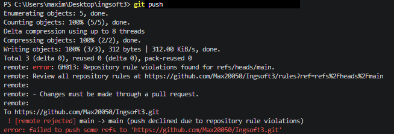
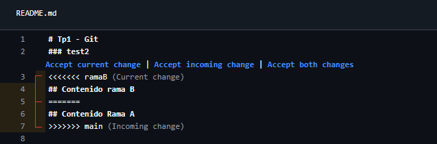
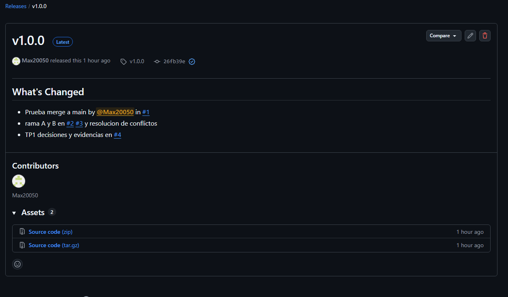
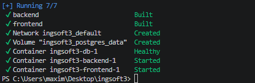
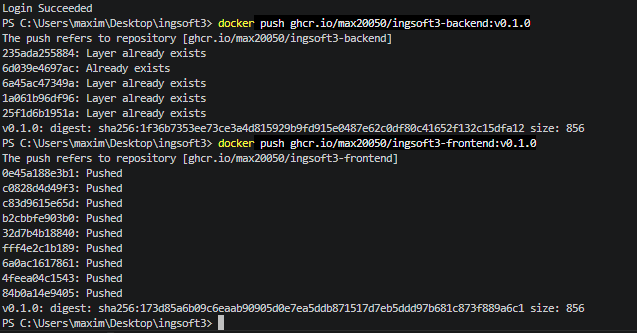
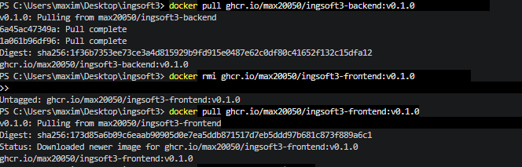
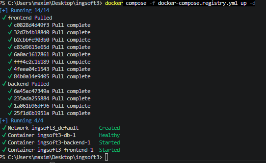

# Evidencias — TP1

## 1. Push directo a main rechazado

GitHub rechaza el push porque main está protegida y la regla alcanza también al dueño del repo.

## 2. El PR de la rama B no se puede mergear: conflicto

Github nos muestra las lineas de codigo con conflicto y nos pide que las resolvamos antes de hacer merge. (bloqueado)

## 3. Release v1.0.0

Release del TP1

# Evidencias — TP2

## 1. docker-compose up -d funciona y todo corre

## 2. Podemos hacer push de la imagenes:

## 3. Podemos hacer pull de las imagenes:

Se puede hacer pull de las imagenes sin estar logeados por lo que las imagenes estan publicas y todo el mundo las puede acceder.

## 4. Podemos hacer docker compose -f docker-compose.registry.yml up -d:

Se hizo desde 0 un docker compose -f docker-compose.registry.yml up -d y lo levanto sin problemas 